# MANGU Publishing - System Architecture

## Overview
MANGU Publishing is a cloud-native publishing platform deployed on AWS, leveraging ECS Fargate for containerized workloads, RDS PostgreSQL for relational data, ElastiCache Redis for caching, and CloudFront for global content delivery.

## Architecture Diagram

```mermaid
graph TB
    subgraph "Client Layer"
        Users[End Users]
        DNS[Route53 DNS]
    end

    subgraph "CDN Layer - CloudFront"
        CF[CloudFront Distribution]
        CFCache[Edge Caching]
    end

    subgraph "Application Layer - us-east-1"
        subgraph "Load Balancing"
            ALB[Application Load Balancer]
            WAF[AWS WAF]
        end
        
        subgraph "VPC - 10.0.0.0/16"
            subgraph "Public Subnets"
                NAT1[NAT Gateway AZ-1]
                NAT2[NAT Gateway AZ-2]
            end
            
            subgraph "Private Subnets - ECS Fargate"
                ServerTask1[Server Task - AZ1]
                ServerTask2[Server Task - AZ2]
                ClientTask1[Client Task - AZ1]
                ClientTask2[Client Task - AZ2]
            end
            
            subgraph "Private Subnets - Data"
                RDS[(RDS PostgreSQL<br/>Multi-AZ)]
                Redis[(ElastiCache Redis<br/>Cluster Mode)]
            end
        end
        
        subgraph "Container Registry"
            ECR[Amazon ECR<br/>Server & Client Images]
        end
    end

    subgraph "Storage Layer"
        S3Uploads[S3 - Uploads Bucket<br/>Versioned]
        S3Static[S3 - Static Assets<br/>Versioned]
    end

    subgraph "Secrets & Config"
        SecretsManager[AWS Secrets Manager<br/>DB, Redis, JWT, Stripe, Sentry]
    end

    subgraph "Monitoring & Logs"
        CloudWatch[CloudWatch Logs & Metrics]
        Sentry[Sentry Error Tracking]
        CostExplorer[AWS Cost Explorer]
    end

    subgraph "Disaster Recovery - us-west-2"
        DRSnapshots[(RDS Snapshots<br/>Daily Copy)]
        DRS3[S3 Cross-Region Replication]
    end

    subgraph "CI/CD"
        GitHub[GitHub Actions]
        CodeDeploy[ECS Circuit Breaker]
    end

    Users -->|HTTPS| DNS
    DNS -->|CNAME| CF
    CF -->|Cache Miss| ALB
    CF -->|/static/*| S3Uploads
    CF -->|/assets/*| S3Static
    
    ALB -->|Port 3000| ServerTask1
    ALB -->|Port 3000| ServerTask2
    ALB -->|Port 80| ClientTask1
    ALB -->|Port 80| ClientTask2
    
    WAF -->|Rate Limiting & Rules| ALB
    
    ServerTask1 -->|Read/Write| RDS
    ServerTask2 -->|Read/Write| RDS
    ServerTask1 -->|Cache| Redis
    ServerTask2 -->|Cache| Redis
    
    ServerTask1 -->|Upload/Download| S3Uploads
    ServerTask2 -->|Upload/Download| S3Uploads
    
    ServerTask1 -.->|Read Secrets| SecretsManager
    ServerTask2 -.->|Read Secrets| SecretsManager
    
    ServerTask1 -->|Logs & Metrics| CloudWatch
    ServerTask2 -->|Logs & Metrics| CloudWatch
    ServerTask1 -->|Error Events| Sentry
    ServerTask2 -->|Error Events| Sentry
    
    GitHub -->|Push Images| ECR
    GitHub -->|Deploy| ServerTask1
    GitHub -->|Deploy| ServerTask2
    
    RDS -.->|Daily Snapshot Copy| DRSnapshots
    S3Uploads -.->|Async Replication| DRS3
    
    CodeDeploy -.->|Auto Rollback| ServerTask1

    style CF fill:#FF9900
    style ALB fill:#FF9900
    style RDS fill:#3B48CC
    style Redis fill:#DC382D
    style S3Uploads fill:#569A31
    style S3Static fill:#569A31
    style ECR fill:#FF9900
    style SecretsManager fill:#DD344C
    style CloudWatch fill:#FF4F8B
    style Sentry fill:#362D59
```

## Component Details

### Frontend (React + Vite)
- **Technology**: React 18, Vite, TypeScript
- **Deployment**: Nginx container on ECS Fargate
- **Port**: 80
- **Features**:
  - Server-side rendering via Nginx
  - Environment-based API configuration
  - Error boundary with Sentry integration
  - Responsive design with Tailwind CSS

### Backend (Node.js + Express)
- **Technology**: Node.js 20, Express, PostgreSQL driver
- **Deployment**: ECS Fargate
- **Port**: 3000
- **Features**:
  - RESTful API endpoints
  - JWT authentication
  - Stripe payment integration
  - Redis caching layer
  - Rate limiting (100 req/15min per IP)
  - Structured JSON logging (Winston)
  - Sentry error monitoring

### Database (PostgreSQL 16)
- **Instance**: RDS db.t3.small
- **Storage**: 50GB gp3 with auto-scaling to 100GB
- **Configuration**:
  - Multi-AZ deployment for high availability
  - 7-day automated backups
  - Point-in-time recovery enabled
  - Performance Insights enabled
  - Encrypted at rest (AES-256)
  - Connection pooling: 20 max connections

### Cache Layer (Redis 7.1)
- **Type**: ElastiCache cluster
- **Nodes**: 2x cache.t3.micro (Multi-AZ)
- **Features**:
  - Automatic failover
  - In-transit encryption (TLS)
  - At-rest encryption
  - LRU eviction policy
  - Used for:
    - Featured books cache
    - Trending books cache
    - Session storage (future)
    - Rate limiting counters

### Load Balancer & Security
- **ALB**:
  - HTTP (80) → HTTPS (443) redirect
  - HTTPS with TLS 1.3
  - Health checks: `/api/health` (30s interval)
  - Sticky sessions enabled (24h cookie)
  - Cross-zone load balancing

- **AWS WAF**:
  - Rate limiting: 2000 req/5min per IP
  - AWS Managed Rules: Common vulnerabilities
  - AWS Managed Rules: Known bad inputs
  - Geo-restrictions: None (global access)

- **Security Groups**:
  - ALB: Inbound 80/443 from 0.0.0.0/0
  - ECS Tasks: Inbound 3000 from ALB only
  - RDS: Inbound 5432 from ECS Tasks only
  - Redis: Inbound 6379 from ECS Tasks only

### CDN (CloudFront)
- **Distribution**: Global edge locations
- **Origins**:
  1. ALB (dynamic content + API)
  2. S3 Static Assets
  3. S3 Uploads
- **Cache Behaviors**:
  - `/api/*` → ALB (no cache)
  - `/assets/*` → S3 Static (1 day TTL)
  - `/static/*` → S3 Uploads (1 day TTL)
  - `/*` → ALB (default, for SPA routing)
- **SSL**: ACM certificate with TLS 1.2+

### Storage
- **Uploads Bucket**:
  - Versioning enabled
  - Lifecycle: 30d → IA, 90d → Glacier
  - CORS configured for direct uploads
  - CloudFront OAC for secure access

- **Static Assets Bucket**:
  - Versioning enabled
  - CloudFront OAC for secure access
  - Build artifacts from CI/CD

### Secrets Management
All secrets stored in AWS Secrets Manager with 7-day recovery window:
- Database credentials (auto-generated)
- Redis auth token (auto-generated)
- JWT signing secret (manual)
- Stripe API keys (manual)
- Cognito config (manual)
- Sentry DSN (manual)

### Monitoring & Observability
- **CloudWatch**:
  - Application logs: `/ecs/mangu-publishing-cluster-production`
  - RDS logs: PostgreSQL and upgrade logs
  - Redis logs: Slow log and engine log
  - Metrics: CPU, memory, network, custom app metrics
  - Alarms: High error rate, DB connections, cache hits

- **Sentry**:
  - Real-time error tracking
  - Performance monitoring (10% sample rate)
  - Release tracking via Git SHA
  - User context and breadcrumbs

- **Cost Monitoring**:
  - AWS Budgets: $500/month alert at 80%
  - Cost Anomaly Detection: $50+ anomaly threshold
  - Daily cost reports via email

### CI/CD Pipeline
1. **Code Push** → GitHub
2. **Tests**: Linting, type checking, unit tests, integration tests
3. **Build**: Docker images for server and client
4. **Scan**: Trivy vulnerability scanning
5. **Push**: Images to ECR with SHA tag
6. **Deploy**: ECS service force new deployment
7. **Migrate**: Database migrations (if any)
8. **Wait**: Services stable check (5 min timeout)
9. **Smoke Tests**: Health check, API endpoints
10. **Tag**: Promote to `stable` on success
11. **Rollback**: ECS Circuit Breaker auto-rollback on failure

### Disaster Recovery
- **RTO (Recovery Time Objective)**: 4 hours
- **RPO (Recovery Point Objective)**: 1 hour (PITR)
- **DR Region**: us-west-2

**Procedures**:
1. **Database**: Daily automated snapshots copied to us-west-2
2. **S3**: Cross-region replication to us-west-2
3. **Infrastructure**: Terraform state in S3 with versioning
4. **Runbook**: See [docs/runbooks/backup-and-restore.md](./runbooks/backup-and-restore.md)

## Network Architecture

### VPC Layout
- **CIDR**: 10.0.0.0/16
- **Subnets**:
  - Public Subnet AZ-1: 10.0.0.0/24
  - Public Subnet AZ-2: 10.0.1.0/24
  - Private Subnet AZ-1: 10.0.10.0/24
  - Private Subnet AZ-2: 10.0.11.0/24

### Routing
- **Public Subnets**: Route to Internet Gateway
- **Private Subnets**: Route to NAT Gateway (HA across AZs)
- **VPC Endpoints**: Future consideration for S3/DynamoDB

## Scaling Strategy

### Current Capacity
- **Server Tasks**: 2 (1 per AZ)
- **Client Tasks**: 2 (1 per AZ)
- **RDS**: db.t3.small (2 vCPU, 2GB RAM)
- **Redis**: 2x cache.t3.micro (Multi-AZ)

### Auto-Scaling (Future)
- **ECS Target Tracking**: CPU 70%, Memory 80%
- **Min Tasks**: 2, **Max Tasks**: 10
- **Scale-up**: +1 task per 2 min
- **Scale-down**: -1 task per 5 min

### Database Scaling
- **Vertical**: Upgrade instance class during maintenance window
- **Read Replicas**: Add for read-heavy workloads
- **Connection Pooling**: Already configured (max 20)

## Cost Breakdown (Monthly Estimate)

| Service | Configuration | Cost |
|---------|---------------|------|
| ECS Fargate | 4 tasks (0.5 vCPU, 1GB) | ~$30 |
| RDS PostgreSQL | db.t3.small Multi-AZ | ~$70 |
| ElastiCache Redis | 2x cache.t3.micro | ~$25 |
| ALB | 1 ALB + LCU usage | ~$25 |
| NAT Gateway | 2x NAT (HA) | ~$65 |
| CloudFront | 100GB data transfer | ~$10 |
| S3 | 50GB storage + requests | ~$5 |
| Data Transfer | Out to internet | ~$10 |
| Secrets Manager | 6 secrets | ~$3 |
| CloudWatch Logs | 10GB/month | ~$5 |
| **Total** | | **~$248/month** |

*Note: Actual costs may vary based on traffic and usage patterns.*

## Security Best Practices

✅ **Implemented**:
- All data encrypted at rest (RDS, ElastiCache, S3)
- All data encrypted in transit (TLS 1.2+)
- Secrets in AWS Secrets Manager (not environment variables)
- Security groups with least-privilege rules
- No SSH access to infrastructure (serverless)
- WAF with rate limiting and managed rules
- Regular dependency scanning (Snyk, npm audit)
- Container image scanning (Trivy)
- Multi-factor authentication required for AWS console

🔄 **Planned**:
- AWS GuardDuty for threat detection
- AWS Config for compliance monitoring
- VPC Flow Logs for network analysis
- Automated credential rotation (90 days)

## Related Documentation
- [Deployment Guide](./DEPLOYMENT.md)
- [Runbooks](./runbooks/)
- [Cost Monitoring](./COST_MONITORING_GUIDE.md)
- [Infrastructure as Code](../infrastructure/terraform/)

---

**Last Updated**: 2025-11-11  
**Maintained By**: DevOps Team  
**Version**: 1.0
